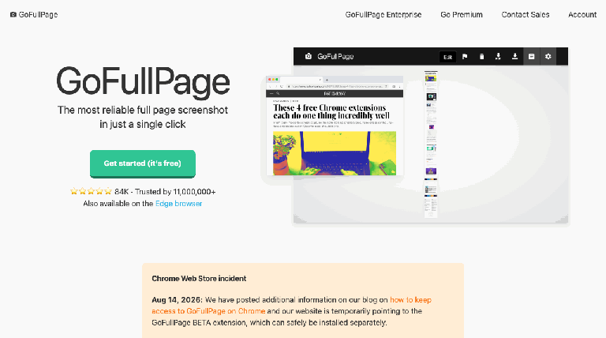
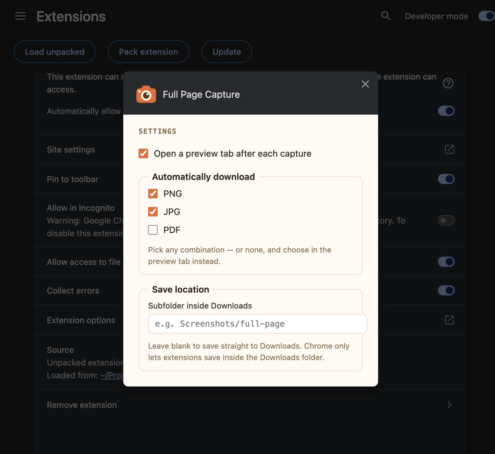

# Full Page Capture 📸

[](https://github.com/katehostetler/full-page-capture/actions/workflows/test.yml)

**A local Chrome extension — just download it, add it to Chrome, and screenshot.**

Captures **full-page screenshots**: it scrolls the page for you, stitches every screen into one image, and saves it as **PNG, JPG, or PDF** — auto-download any combination of the three, or pick manually in the preview tab, with an optional custom save folder. Built as a replacement for GoFullPage after it was removed from the Chrome Web Store.



**100% local. Your screenshots never leave your machine.** There are no servers, no accounts, no analytics, and no network calls — the capture is assembled entirely inside your browser and saved straight to your Downloads folder. The extension uses the minimal `activeTab` permission, which means it can only ever see a page at the moment you click the capture button.

## Install (60 seconds)

**Option 1 — just download it (no git needed):**

1. Grab `full-page-capture.zip` from the [latest release](https://github.com/katehostetler/full-page-capture/releases/latest) and unzip it
2. Open `chrome://extensions` in Chrome
3. Turn on **Developer mode** (toggle, top-right)
4. Click **Load unpacked** (top-left) and select the unzipped folder
5. Pin the 📸 icon via the puzzle-piece menu in your toolbar

**Option 2 — clone the repo** (if you want the tests and source history):

```bash
git clone https://github.com/katehostetler/full-page-capture.git
```

Then follow steps 2–5 above, selecting the repo's **`extension`** folder.

Either way — no build step, no dependencies.

## Use

1. Go to any page and click the camera icon (or press **Alt+Shift+P**)
2. The page scrolls itself; the icon's badge shows percent done, and clicking the icon opens a progress bar with a **✕ Stop capture** button
3. A preview tab opens with the stitched screenshot and **Download PNG / JPG / PDF** buttons
4. Files are named like `example.com_2026-08-17_21.28.38.png` and save with no dialog

### Settings

Right-click the icon → **Options**:



| Setting | What it does |
|---------|--------------|
| **Open a preview tab** | Show the screenshot with download buttons after each capture |
| **Automatically download** | PNG / JPG / PDF checkboxes — any combination downloads instantly |
| **Save location** | A subfolder inside Downloads (blank = Downloads itself) |

Chrome only permits extensions to save inside the Downloads folder — that's a browser security rule, not a choice.

### What it handles

- **Sticky headers & cookie bars** appear once, not repeated in every frame
- **Pages that scroll in an inner container** (Google Images-style apps) are detected and captured correctly
- **Lazy-loading / infinite pages** are followed as they grow (capped at ~50 screens)
- **Very tall pages** split into `_part1`, `_part2`, … files at the canvas limit; PDFs stay one file with multiple pages
- **Huge files** split so no single image exceeds ~24MB
- **Retina/zoom** captured at full physical resolution

## Privacy

- Captures are stitched in your browser and written directly to your disk
- No data is sent anywhere; the extension makes zero network requests
- Permissions: `activeTab` (see the page only when you click), `scripting` (scroll the page), `downloads` (save your file), `offscreen` + `storage` (stitching + your settings)

## Development

```bash
npm install
npm test              # unit tests (vitest)
node e2e/run-e2e.mjs  # end-to-end: loads the extension in Chromium, captures
                      # test pages, clicks the download buttons, checks the files
node e2e/demo-capture.mjs <url>   # capture any URL from the terminal
```

Pure logic (scroll planning, filenames, PDF generation, splitting) lives in `lib/` and is unit-tested; `e2e/run-e2e.mjs` verifies the full capture pipeline in a real browser, including Google-style scroll containers, lazy-loading pages, and mid-capture cancel.

## Project Structure

```
├── extension/   # The Chrome extension — point "Load unpacked" here
├── test/        # Unit tests
├── e2e/         # End-to-end tests + CLI capture tool
├── scripts/     # Icon generation
└── docs/        # README images
```

## License

MIT — see [LICENSE](LICENSE).
